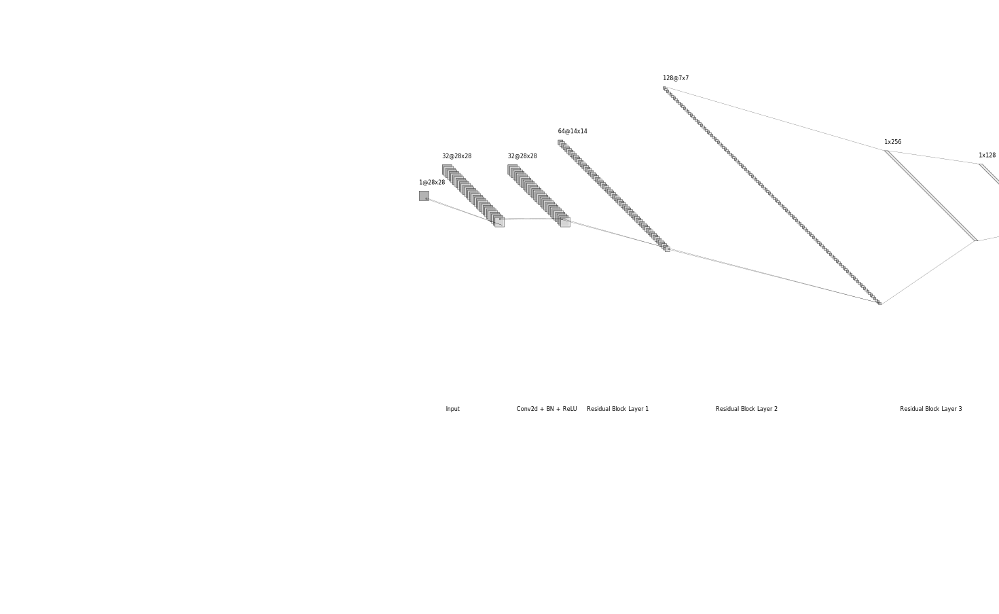
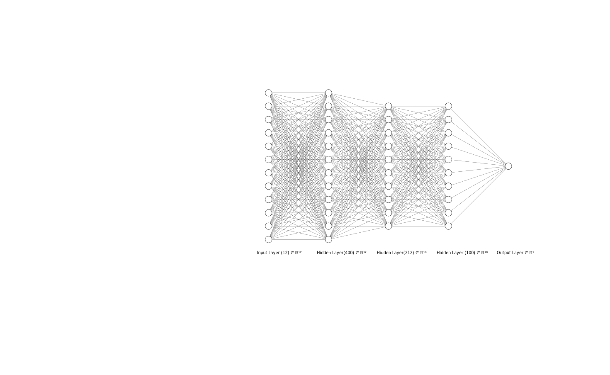

# Kaggle Community Challenges

This repository contains my solutions and experiments for various Kaggle competitions. Each challenge is approached with a focus on both traditional machine learning techniques and deep learning methods.

Follow me at [Kaggle](https://www.kaggle.com/naveenda)

## Challenges

- [Spaceship Titanic](https://www.kaggle.com/competitions/spaceship-titanic)
- [Titanic](https://www.kaggle.com/competitions/titanic)
- [Digit Recognizer](https://www.kaggle.com/competitions/digit-recognizer)

### Digit Recognizer
This is a classic image classification problem. The goal is to classify handwritten digits into 10 categories (0-9).

#### Approach
Use a CNN to classify the digits.

**Score: 0.99635**

### Spaceship Titanic
This is a binary classification problem. The goal is to predict whether a passenger will be transported to another dimension.

#### Approach
Use a simple neural network to classify the passengers.

**Score: 0.80383**

### Titanic
This is a binary classification problem. The goal is to predict whether a passenger survived the Titanic disaster.

#### Approach
1. [Neural Network](./notebooks/titanic-nn.ipynb)
2. [Multi-seed Ensemble](./notebooks/titanic-ensemble.ipynb)
3. [PCA](./notebooks/titanic-pca.ipynb)
4. [SKLearn Neural Network](./notebooks/titanic-sklearn-nn.ipynb)
5. [Random Forest](./notebooks/titanic-random-forest.ipynb)

**Score: 0.78000**

## License
This project is licensed under the MIT License - see the LICENSE file for details.
